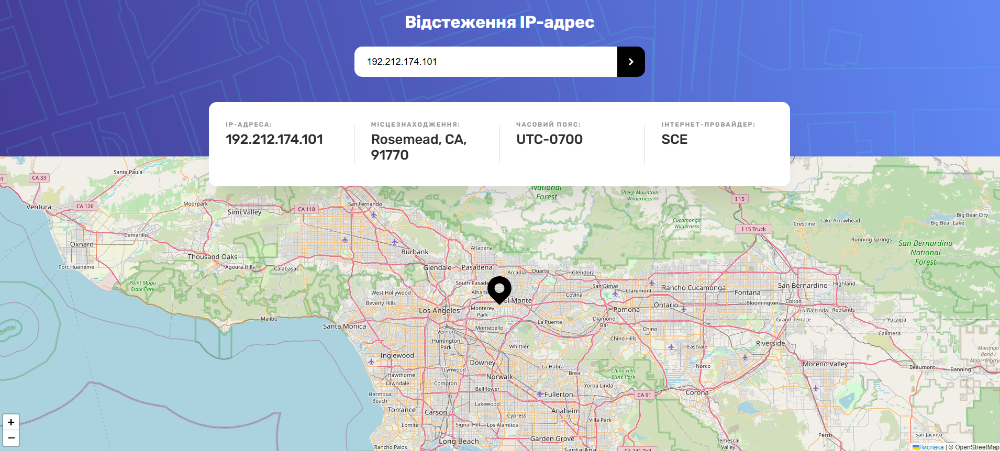

# IP Address Tracker Solution



## Table of Contents

- [Overview](#overview)
  - [The Challenge](#the-challenge)
  - [Demo](#demo)
- [Features](#features)
- [How It Works](#how-it-works)
- [Technologies Used](#technologies-used)
- [Installation](#installation)
- [What I Learned](#what-i-learned)
- [Future Improvements](#future-improvements)
- [Author](#author)
- [Acknowledgments](#acknowledgments)

---

## Overview

### The Challenge

This project is a solution to the **IP Address Tracker** challenge (similar to Frontend Mentor). The goal was to build an interactive web app that allows users to:

- See their **current IP address** and **location on a map** on initial load
- Search for any **IP address or domain**
- View **location**, **timezone**, and **ISP**
- Have a fully responsive design and interactive user experience

### Demo

[🔗 IP Address Tracker](https://juliyapershina.github.io/IP-address-tracker/) — *(go to deployment link)*

---

## Features

- 📍 **Map Integration** via [Leaflet.js](https://leafletjs.com/) and [OpenStreetMap](https://www.openstreetmap.org/)
- 🌐 **IP Geolocation Lookup** using the [`https://ipapi.co`](https://ipapi.co/) API
- 🔍 **Search by IP or domain**
- 🖥️ **Responsive design** for mobile, tablet, and desktop
- 💡 **Error handling** for invalid IP/domain queries

---

## How It Works

1. On page load:
   - The app fetches the user's IP and location from `ipapi.co`
   - If supported, it tries to get precise geolocation from the browser API
   - The info is displayed and a pin is set on the map

2. When a user enters an IP or domain:
   - A request is made to the API
   - If successful, it updates the IP info and recenters the map to that location

3. UI:
   - IP address, location, timezone, and ISP are displayed in clean cards
   - The map is interactive and resizes automatically

---

## Technologies Used

- HTML5
- CSS3 / SCSS-like syntax
- TypeScript (with DOM types)
- Leaflet.js (for maps)
- IPAPI (`ipapi.co`)
- Google Fonts: [Rubik](https://fonts.google.com/specimen/Rubik)

---

## Installation

To run locally:

1. Clone this repository:

```bash
git clone https://github.com/JuliyaPershina/IP-address-tracker
cd ip-tracker
```
## Getting Started

Open `index.html` in your browser, or use a live server extension (e.g. [VS Code Live Server](https://marketplace.visualstudio.com/items?itemName=ritwickdey.LiveServer)).

⚠️ Ensure that all assets (e.g., `/images`, `/dist/script.js`) are correctly placed.

---

## What I Learned

- ✅ Integration of third-party APIs (**IPAPI** & **Leaflet**)
- 🔁 Managing asynchronous requests and error handling
- 🧩 DOM manipulation with TypeScript
- 📱 Responsive UI and adaptive layout logic
- 🗺️ Centering Leaflet maps dynamically based on geolocation or IP lookup

---

## Future Improvements

- 🧭 Add reverse DNS resolution  
- 🌗 Add theme toggle (dark/light)  
- 🧪 Add unit tests for fetch logic  
- 🧠 Implement IP/domain validation before fetch  
- 🔐 Use a proxy or server-side handler to hide API calls (for security)

---

## Author

- GitHub: [@JuliyaPershina](https://github.com/JuliyaPershina)  


